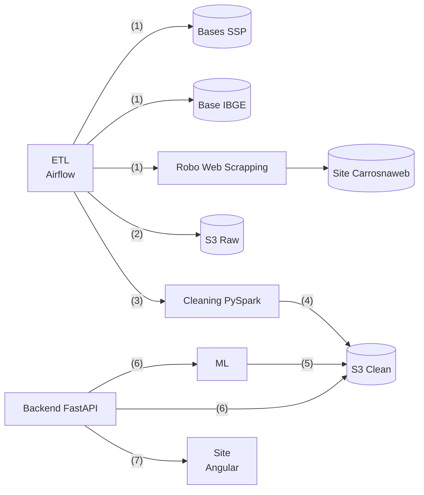

# data-analysis
Jobs and studies used to create CriminiX's inference models

## Architecture

```mermaid
flowchart LR
    SSP[("Bases SSP")]
    IBGE[("Base IBGE")]
    Carrosnaweb[("Site Carrosnaweb")]
    S3_RAW[("S3 Raw")]
    S3_CLEAN[("S3 Clean")]
    Airflow["ETL \n Airflow"]
    WebScraper["Robo Web Scrapping"]
    Frontend["Site \n Angular"]
    Backend["Backend FastAPI"]
    PySpark["Cleaning PySpark"]
    ML["ML"]

    Airflow -- "(1)" --> SSP
    Airflow -- "(1)" --> IBGE
    Airflow -- "(1)" --> WebScraper --> Carrosnaweb
    Airflow -- "(2)" --> S3_RAW
    Airflow -- "(3)" --> PySpark -- "(4)" --> S3_CLEAN
    ML -- "(5)" --> S3_CLEAN
    Backend -- "(6)" --> ML
    Backend -- "(6)" --> S3_CLEAN
    Backend -- "(7)" --> Frontend
  
```
